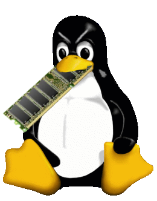

***

# LinuxAteMyRAMApp

`🐧️💻️🖥️💾️ The official source repository for the LinuxAteMyRAM application, making` https://github.com/koalaman/linuxatemyram.com `into a software application.`

# Full credit goes to: [:octocat: `koalaman/LinuxAteMyRAM.com`](https://github.com/koalaman/linuxatemyram.com)

***

## Additional planned features

- [ ] Software tools for testing memory usage (as described in the site)
- [ ] Desktop application wrapper
- [ ] More documentation
- [ ] Snap package
- [ ] Flatpak package
- [ ] Debian package
- [ ] RPM package

***

## Web application or desktop application

It is a mixture of both. It is bootstrapped in Python, and contains HTML and CSS data.

***

## Support

Which Linux distributions support this program? (none yet, as this program is not functional yet)

### Default program

| Base | Distribution |
|---|---|
| None | No distributions have this as a default program yet |

### Package available

| Base | Distribution |
|---|---|
| None | No distributions have this as a default program yet |

***

## Documentation

Further documentation is available in a separate repository.

> [:octocat: `Click/tap here to go to the official documentation source repository`](https://github.com/seanpm2001/LinuxAteMyRAMApp_Docs/)

***

# File info

- **File version:** `1 (2023, Sunday, November 5th at 8:52 pm PST)`
- **Line count (including blank lines and compiler line):** `96`

***

# File history

## Version 1 (2023, Sunday, November 5th at 8:52 pm PST)

- This version was made by [:octocat: `@seanpm2001`](https://github.com/seanpm2001/)

> Changes

- [x] Started the file
- [x] Added the title section
- [x] Added the `Additional planned features` section
- [x] Added the `Web application or desktop application?` section
- [x] Added the `Support` section
- - [x] Added the `Default program` subsection
- - [x] Added the `Package available` subsection
- [x] Added the `Documentation` section
- [x] Added the `File info` section
- [x] Added the `File history` section
- - [x] Added an entry for version 1
- [x] Added the footer
- [ ] No other changes in version 1

***

# Footer

You have reached the end of this page.

###### EOF

***
